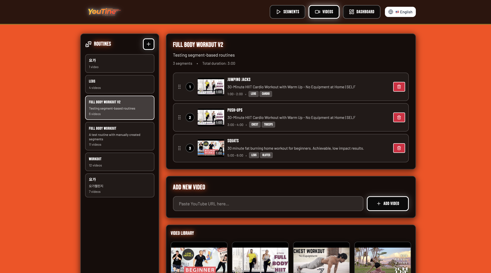
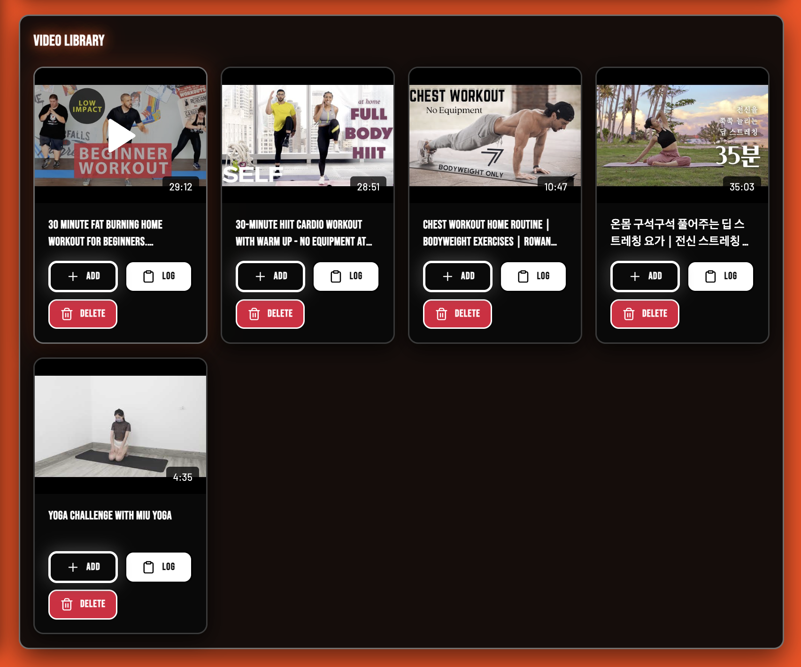
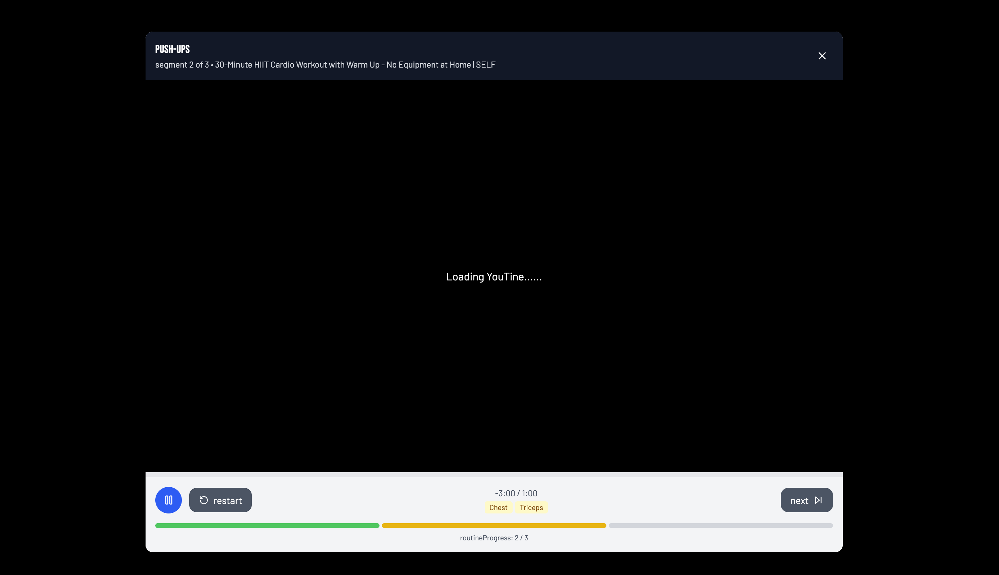
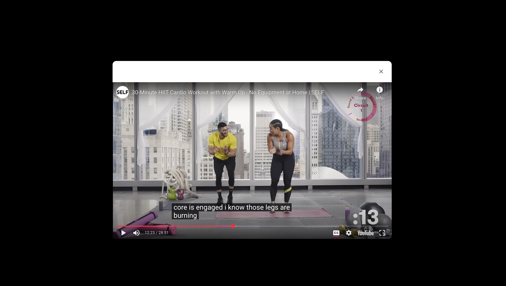
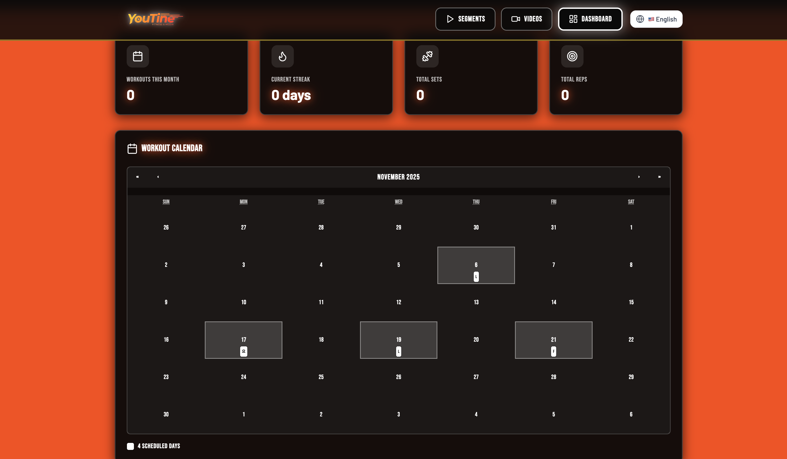

# YouTine 🏋️‍♀️

<div align="center">

> **혼자 운동하는 갓생러들을 위한 AI 기반 융합 헬스케어 서비스**

[](https://github.com/metahwi/youtine-sesac-hackathon-2025)
[](https://react.dev)
[](https://openai.com)
[](https://opencv.org)
[](https://github.com/metahwi/youtine-sesac-hackathon-2025)

**팀명**: 잭과 콩이담 | **팀원**: 강이담, 이재휘

[📺 데모 보기](#-데모-영상) · [🚀 시작하기](#%EF%B8%8F-설치-및-실행-방법) · [📚 문서](./docs)

</div>

---

## 📺 데모 영상

<table>
  <tr>
    <td width="50%">
      <h3 align="center">🎨 YouTine Web Application</h3>
      <p align="center">
        <!-- ✅ 교체 완료: 실제 스크린샷 -->
        
        <br/>
        <sub>AI가 분석한 운동 구간들을 카드 형태로 표시</sub>
      </p>
    </td>
    <td width="50%">
      <h3 align="center">➕ YouTube Video Analysis</h3>
      <p align="center">
        <!-- ✅ 교체 완료: 실제 스크린샷 -->
        
        <br/>
        <sub>유튜브 URL 입력 시 자동으로 운동 구간 추출</sub>
      </p>
    </td>
  </tr>
  <tr>
    <td width="50%">
      <h3 align="center">✂️ AI-Powered Segment Editor</h3>
      <p align="center">
        
        <br/>
        <sub>LLM API와 Transcript를 활용한 영상 구간 분할 및 커스터마이징</sub>
      </p>
    </td>
    <td width="50%">
      <h3 align="center">🎬 SmartPlayer (핵심 기능)</h3>
      <p align="center">
        
        <br/>
        <sub>여러 영상의 구간들을 끊김 없이 연속 재생</sub>
      </p>
    </td>
  </tr>
  <tr>
    <td width="50%">
      <h3 align="center">📊 Dashboard & Analytics</h3>
      <p align="center">
        
        <br/>
        <sub>운동 기록, 스트릭, 통계 시각화</sub>
      </p>
    </td>
    <td width="50%">
      <h3 align="center">🤖 AI Motion Coaching</h3>
      <p align="center">
        
        <br/>
        <sub>MediaPipe + OpenCV로 실시간 자세 분석 및 피드백</sub>
      </p>
    </td>
  </tr>
</table>

### 🎥 데모 영상 (YouTube)

> *데모 영상 준비 중*

---

## 🎯 프로젝트 소개

### 💡 핵심 가치

**YouTine**은 유튜브로 운동하는 모든 사람이 겪는 **3대 문제**를 AI 기술로 해결합니다:

| 문제 | 솔루션 |
|------|--------|
| 🔍 **탐색의 번거로움**<br/>수많은 영상을 찾고 조합하는 시간 낭비 | 🤖 AI가 자동으로 영상을 분석하여<br/>최적의 루틴 생성 |
| ⚠️ **자세의 부정확성**<br/>잘못된 자세로 인한 부상 위험 | 📷 실시간 포즈 트래킹으로<br/>즉각적인 자세 교정 피드백 |
| 😴 **동기부여 부족**<br/>혼자 운동하다 중간에 포기 | 🎮 게임화 + AI 보이스로<br/>지속적인 운동 습관 형성 |

> "유튜브 영상을 보며 운동하는 것은 좋지만, 매번 영상을 찾아 헤매고, 자세가 정확한지 확인할 수 없으며, 혼자 운동하다 보면 지루해서 중간에 포기하게 됩니다."
>
> → **YouTine은 AI 기술로 이 모든 문제를 한 번에 해결합니다.**

---

## 🚀 3대 핵심 기능

### 1️⃣ AI 루틴 플래너 (What to do)

<div align="center">
  
  <br/>
  <sub><i>📸 촬영 필요: URL 입력 → Processing → Segments 추출 과정 GIF</i></sub>
</div>

<br/>

**"30분 하체, 유산소"** 같은 간단한 요청만으로 AI가 자동으로 최적의 운동 루틴을 생성합니다.

- 📹 **유튜브 영상 자동 분석**: OpenAI GPT-4-mini로 자막 분석
- ✂️ **스마트 구간 분할**: 긴 영상을 운동 동작 단위로 자동 분할 (예: 스쿼트 구간만 추출)
- 🎯 **맞춤형 루틴 조합**: 목표, 시간, 숙련도에 맞는 운동 영상 자동 조합
- 🔄 **끊김 없는 재생**: 여러 영상의 구간들을 하나의 루틴으로 연속 재생

**기술 구현**: OpenAI API, YouTube Transcript API, MongoDB 기반 세그먼트 관리

---

### 2️⃣ AI 모션 코칭 (How to do)

<div align="center">
  
</div>

<br/>

**실시간 자세 교정**으로 부상을 방지하고 운동 효과를 극대화합니다.

- 📷 **실시간 포즈 트래킹**: MediaPipe + OpenCV로 33개 신체 랜드마크 감지
- ⚠️ **즉각적인 피드백**: "허리가 굽었어요", "무릎이 발끝보다 나왔어요" 등 음성/시각 알림
- 📊 **자세 정확도 점수**: 운동 종료 후 자세 정확도 리포트 제공
- 🎯 **13가지 운동 지원**: 스쿼트, 푸쉬업, 런지, 플랭크, 점핑잭 등

**기술 구현**: Python + MediaPipe Pose + OpenCV (프로토타입 완성)

---

### 3️⃣ AI 보이스 파트너 (Motivation)

**1:1 트레이너처럼** 숫자를 세어주고 응원하며 강력한 동기를 부여합니다.

- 🗣️ **다양한 AI 보이스**: '최애 아이돌', '열정 트레이너', '화난 할머니' 등 선택 가능
- 🔢 **자동 카운팅**: 운동 동작에 맞춰 "하나, 둘" 숫자를 세어줌
- 💪 **동기부여 멘트**: "하나만 더!", "거의 다 왔습니다!" 등 실시간 응원
- 🎮 **게임화 요소**: 스트릭, 챌린지, 리포트로 지속적인 운동 습관 형성

**기술 구현**: TTS(Text-to-Speech) API 연동 예정

---

## 📊 문제 정의 & 배경

### 📈 실제 사용자 불편 사례

**설문조사 결과** (홈트 이용자 100명 대상)

```
동기부여 부족         ████████████████████████████████████████ 78%
루틴 구성의 어려움     ████████████████████████████████ 65%
부정확한 자세 우려     ██████████████████████████ 52%
```

### 👥 우리 팀의 경험

<table>
  <tr>
    <td width="50%">
      <h4>🔰 초급자 사례 (강이담)</h4>
      <p>수많은 영상 중 자신에게 맞는 영상을 찾고 조합하는 데 많은 시간 소모. 메모장이나 카카오톡에 링크를 저장하지만 가용성 부족.</p>
    </td>
    <td width="50%">
      <h4>💪 숙련자 사례 (이재휘, 5년 차)</h4>
      <p>매번 같은 루틴에 지루함을 느낌. 혼자 운동할 때 'Gym Bro(운동 파트너)'가 없어 동기부여 급감.</p>
    </td>
  </tr>
</table>

> **→ YouTine은 이러한 실제 문제를 해결하기 위해 탄생했습니다.**

---

## 🛠️ 기술 스택

<table>
  <tr>
    <td width="33%" align="center">
      <h3>Frontend</h3>
      
      <br/>
      
      <br/>
      
      <br/>
      
    </td>
    <td width="33%" align="center">
      <h3>Backend</h3>
      
      <br/>
      
      <br/>
      
      <br/>
      
    </td>
    <td width="33%" align="center">
      <h3>AI/ML</h3>
      
      <br/>
      
      <br/>
      
      <br/>
      
    </td>
  </tr>
</table>

<details>
<summary><b>📦 전체 기술 스택 상세보기</b></summary>

### Frontend
- **React 19.1.0** + Vite 6.3.5 - 최신 React with Server Components
- **Tailwind CSS 4.1.7** - 유틸리티 기반 모던 UI 스타일링
- **React Router DOM 7.6.1** - 클라이언트 사이드 라우팅
- **React Player** - YouTube 영상 재생
- **Framer Motion** - 부드러운 애니메이션
- **Recharts** - 운동 통계 시각화
- **i18n** - 한국어/영어 지원

### Backend
- **Node.js** + Express 5.1.0 - RESTful API 서버
- **MongoDB** + Mongoose 8.19.1 - NoSQL 데이터베이스
- **OpenAI API** (GPT-4-mini) - 운동 영상 자막 분석
- **YouTube Transcript API** - 자막 추출
- **YTDL Core** - YouTube 메타데이터 수집

### AI/ML
- **OpenAI GPT-4-mini** - 자연어 처리 및 운동 구간 분석
- **MediaPipe Pose** - 실시간 포즈 추정 (33개 랜드마크)
- **OpenCV (cv2)** - 영상 처리 및 시각화
- **NumPy** - 각도 계산 및 수치 처리

### Development Tools
- **pnpm** - 빠른 패키지 관리
- **Vitest** - 유닛 테스트
- **ESLint** + Prettier - 코드 품질 관리

</details>

---

## 📁 프로젝트 구조

```
youtine-sesac-hackathon-2025/
├── 📱 web-app/                    # 메인 웹 애플리케이션
│   ├── client/                    # React 프론트엔드
│   │   ├── src/
│   │   │   ├── components/        # UI 컴포넌트 (19개)
│   │   │   │   ├── SmartPlayer.jsx    # 🌟 핵심: 다중 세그먼트 재생
│   │   │   │   ├── SegmentLibrary.jsx
│   │   │   │   ├── DashboardPage.jsx
│   │   │   │   └── ...
│   │   │   ├── services/          # API 클라이언트
│   │   │   ├── i18n/              # 다국어 지원 (KO/EN)
│   │   │   └── utils/
│   │   └── package.json
│   │
│   └── server/                    # Express 백엔드
│       ├── models/                # MongoDB 스키마 (5개)
│       ├── routes/                # API 라우트 (6개)
│       ├── services/              # 🤖 AI 분석 서비스
│       └── server.js
│
├── 🐍 prototypes/                 # AI 모션 코칭 프로토타입
│   └── python-squat-counter/      # OpenCV 기반 포즈 트래킹
│       ├── src/
│       │   ├── core/              # MediaPipe 포즈 감지
│       │   ├── exercises/         # 운동별 카운터 (13개)
│       │   └── utils/
│       └── tests/                 # 13가지 운동 테스트
│
└── 📚 docs/                       # 프로젝트 문서
    ├── ARCHITECTURE.md            # 시스템 아키텍처
    ├── DATABASE_SCHEMA.md         # DB 스키마 상세
    └── API_DOCUMENTATION.md       # REST API 문서 (30+ endpoints)
```

---

## ⚙️ 설치 및 실행 방법

### 📋 사전 요구사항

- **Node.js** 18.x 이상
- **MongoDB** (로컬 또는 MongoDB Atlas)
- **Python 3.8+** (모션 코칭 프로토타입용)
- **OpenAI API Key** (필수) - [발급 받기](https://platform.openai.com/api-keys)
- **pnpm** (권장) - `npm install -g pnpm`

---

### 1️⃣ 레포지토리 클론

```bash
git clone https://github.com/metahwi/youtine-sesac-hackathon-2025.git
cd youtine-sesac-hackathon-2025
```

---

### 2️⃣ 백엔드 설정

```bash
cd web-app/server
npm install

# 환경 변수 설정
cp .env.example .env
# 📝 .env 파일을 열어 MongoDB URI와 OpenAI API 키 입력

# 서버 실행
npm run dev
```

✅ 서버가 `http://localhost:3000`에서 실행됩니다.

---

### 3️⃣ 프론트엔드 설정

```bash
# 새 터미널 창에서
cd web-app/client
pnpm install

# 개발 서버 실행
pnpm dev
```

✅ 프론트엔드가 `http://localhost:5173`에서 실행됩니다.

---

### 4️⃣ Python 모션 코칭 프로토타입 (선택사항)

```bash
cd prototypes/python-squat-counter

# 가상환경 생성 및 활성화
python -m venv venv
source venv/bin/activate  # Windows: venv\Scripts\activate

# 의존성 설치
pip install opencv-python mediapipe numpy

# 스쿼트 테스트 실행
python tests/test_squat.py
```

---

### 🔐 환경 변수 설정

`web-app/server/.env` 파일 예시:

```bash
# MongoDB 설정
MONGODB_URI=mongodb://localhost:27017/fittrack

# OpenAI API 키 (필수)
OPENAI_API_KEY=sk-your-openai-api-key-here

# 서버 포트
PORT=3000

# 환경
NODE_ENV=development
```

---

## 🎮 사용 방법

### 📝 빠른 시작 가이드

<table>
  <tr>
    <th width="5%">Step</th>
    <th width="25%">작업</th>
    <th width="70%">설명</th>
  </tr>
  <tr>
    <td align="center">1️⃣</td>
    <td><b>영상 추가</b></td>
    <td>
      • "Videos" 탭 이동<br/>
      • YouTube URL 입력<br/>
      • AI가 자동으로 운동 구간 추출 (10-30초 소요)
    </td>
  </tr>
  <tr>
    <td align="center">2️⃣</td>
    <td><b>루틴 생성</b></td>
    <td>
      • "Segments" 탭에서 운동 구간 확인<br/>
      • 원하는 구간 선택 → "Add to Routine"<br/>
      • 드래그 앤 드롭으로 순서 변경
    </td>
  </tr>
  <tr>
    <td align="center">3️⃣</td>
    <td><b>운동 시작</b></td>
    <td>
      • 루틴 선택 → "Play Routine" 클릭<br/>
      • SmartPlayer가 모든 구간을 끊김 없이 연속 재생<br/>
      • 진행률 실시간 표시
    </td>
  </tr>
  <tr>
    <td align="center">4️⃣</td>
    <td><b>기록 관리</b></td>
    <td>
      • "Dashboard" 탭에서 통계 확인<br/>
      • 캘린더에서 운동 이력 조회<br/>
      • 운동 일지 작성
    </td>
  </tr>
</table>

---

## 📈 기대 효과

### 🌍 사회적 효과
- ✅ 고가의 오프라인 PT 비용 부담 감소 (평균 PT 비용: 회당 5-10만원)
- ✅ 실시간 자세 교정으로 부상 위험 감소 → 국민 건강 증진 및 의료비 절감
- ✅ 게임화(Gamification) 요소로 지속적인 운동 습관 형성

### 💰 경제적 효과
- ✅ 디지털 헬스케어 시장의 질적 성장 견인
- ✅ 유튜브 크리에이터와 상생하는 새로운 콘텐츠 유통 모델

### 🚀 기술적 확장 가능성
- ✅ **AR 스마트 글래스 연동**: 향후 AR 글래스 상용화 시, 몰입형 운동 경험 제공
- ✅ **웨어러블 디바이스 연동**: 스마트워치로 심박수, 칼로리 소모 실시간 측정
- ✅ **소셜 기능 확장**: 친구와 챌린지, 리더보드, 운동 기록 공유

---

## 🏆 2025 새싹 해커톤 관련 정보

### ✅ MVP(Minimum Viable Product) 구현 현황

| 기능 | 상태 | 설명 |
|------|------|------|
| 웹 애플리케이션 | ✅ 완료 | React + Express + MongoDB 풀스택 앱 |
| AI 루틴 플래너 | ✅ 완료 | OpenAI API 영상 분석 및 구간 추출 |
| AI 모션 코칭 | ✅ 완료 | Python + OpenCV + MediaPipe 프로토타입 |
| AI 보이스 파트너 | 🔄 진행중 | TTS 연동 예정 |

### 📊 예선 평가 포인트

- ✅ **개발 현황 확인**: 실제 작동하는 코드와 프로토타입 제공
- ✅ **기술 혁신성**: AI(LLM + CV)를 활용한 차별화된 솔루션
- ✅ **확장 가능성**: 모듈화된 구조로 기능 추가 용이
- ✅ **문서화**: 상세한 README, 아키텍처 문서, API 문서 포함

### 🎭 본선 시연 계획

1. **웹 앱 시연** (1분): YouTube 영상 추가 → AI 분석 → 루틴 생성 → 재생
2. **모션 코칭 시연** (1분): Python 프로토타입으로 실시간 자세 교정
3. **통계 대시보드** (30초): 운동 기록 및 분석 기능

---

## 📚 추가 문서

<table>
  <tr>
    <td width="50%">
      <h3>📐 <a href="./docs/ARCHITECTURE.md">시스템 아키텍처</a></h3>
      <p>전체 시스템 구조, 데이터 흐름, AI 통합 방안</p>
    </td>
    <td width="50%">
      <h3>🗄️ <a href="./docs/DATABASE_SCHEMA.md">데이터베이스 스키마</a></h3>
      <p>MongoDB 컬렉션 상세 설명 및 인덱스 전략</p>
    </td>
  </tr>
  <tr>
    <td width="50%">
      <h3>📡 <a href="./docs/API_DOCUMENTATION.md">API 문서</a></h3>
      <p>30+ REST API 엔드포인트 가이드 (cURL 예제 포함)</p>
    </td>
    <td width="50%">
      <h3>🎬 <a href="./DEMO_GUIDE.md">데모 촬영 가이드</a></h3>
      <p>스크린샷, GIF, 영상 촬영 시나리오 및 팁</p>
    </td>
  </tr>
</table>

---

## 🔮 향후 계획

- [ ] AI 보이스 파트너 완성 (TTS 연동)
- [ ] Python 모션 코칭을 웹 앱에 통합 (WebRTC 또는 WebSocket)
- [ ] 소셜 기능 추가 (친구 초대, 챌린지, 리더보드)
- [ ] 모바일 앱 개발 (React Native)
- [ ] 웨어러블 디바이스 연동 (심박수, 칼로리)
- [ ] AR 스마트 글래스 프로토타입

---

## 📄 라이선스

이 프로젝트는 MIT 라이선스를 따릅니다. 자세한 내용은 [LICENSE](./LICENSE) 파일을 참조하세요.

---

## 👥 팀 소개

<div align="center">

### 잭과 콩이담

| 이름 | 역할 | GitHub |
|------|------|--------|
| **강이담** | 서비스 기획 · 브랜딩/디자인 | - |
| **이재휘** | UX · 프론트엔드 · 백엔드 · AI/CV · 시스템 아키텍처 | [@metahwi](https://github.com/metahwi) |

</div>

---

## 📞 문의 및 피드백

프로젝트에 대한 문의사항이나 피드백은 [GitHub Issues](https://github.com/metahwi/youtine-sesac-hackathon-2025/issues)를 통해 남겨주세요.

---

<div align="center">

**Made with 💪 by 잭과 콩이담 for 2025 새싹 해커톤**

⭐ 이 프로젝트가 마음에 드셨다면 Star를 눌러주세요!

</div>
